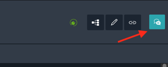
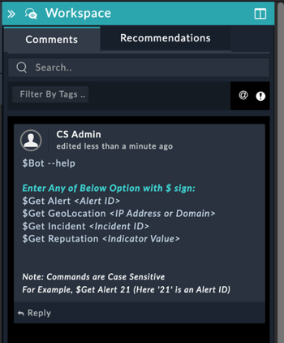

# Usage of ChatOps Solution Pack

## ChatOps Commands

### Syntax

To run the command type *$* and then the command and arguments. You need to type the command in the 'Comments' tab under 'Workspace' as shown below:

For Example. *$Get Alert 1* (Here 1 is Alert ID)

- Click on the 'Workspace' icon in the detailed view of the record

    

- Type command in comment field

    

- The playbooks associated with command will execute in background and provides the respective command output

    

ChatOps Solution Pack supports the following command:

|**Command**|**Description**|
| :- | :- |
| $Bot --help | Displays a list of all the Bot commands. |
| $Get Alert *Alert ID* | Retrieves details of a specific alert based on the provided alert ID.|
| $Get GeoLocation *IP Address or Domain* | Retrieves the Geolocation details for the specified IP Address. |
| $Get Incident *Incident ID* | Retrieves details of a specific incident based on the provided incident ID. |
| $Get Reputation *Indicator Value* | Retrieves the reputation for the specified indicator. |
